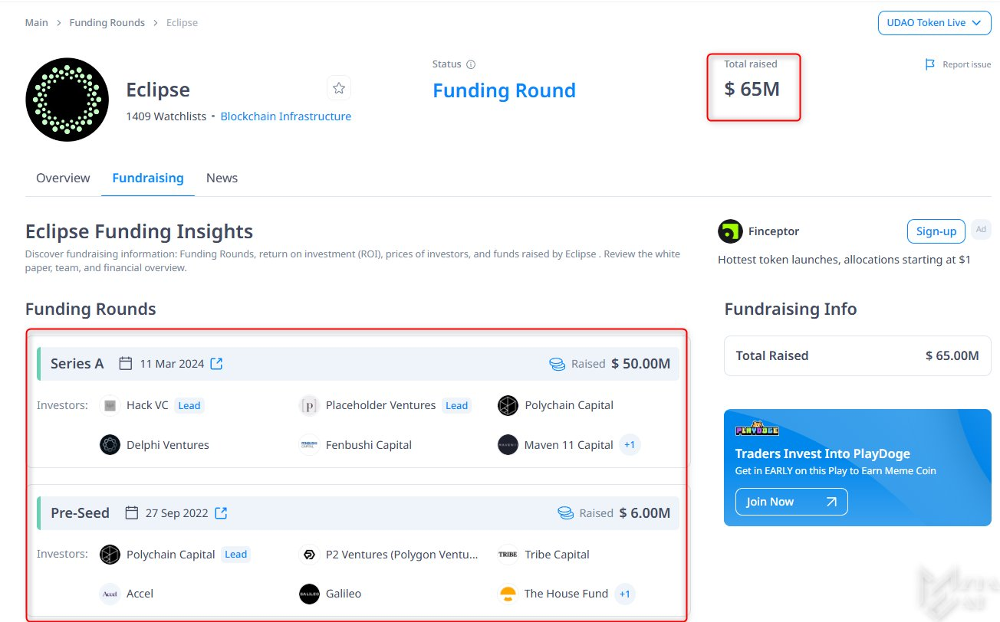

<p align="center">

</p>

## Installation Without VPS or WSL

- Go To : [Codespace](https://github.com/codespaces)
  
- Choose blank template
  
- Copy & Enter the command mentioned below

```bash
wget https://raw.githubusercontent.com/dxzenith/eclipse-testnet/main/eclipse.sh && chmod +x eclipse.sh && ./eclipse.sh
```

- Save Your Phrase & Pubic Key
- Import Your Phrase in Wallet

- Fill this Form After Installation Complete : [Click Here](https://docs.google.com/forms/d/e/1FAIpQLSfJQCFBKHpiy2HVw9lTjCj7k0BqNKnP6G1cd0YdKhaPLWD-AA/viewform?pli=1)

- How to Run [Video Link HERE](https://t.me/hiddengemnews/7002)
